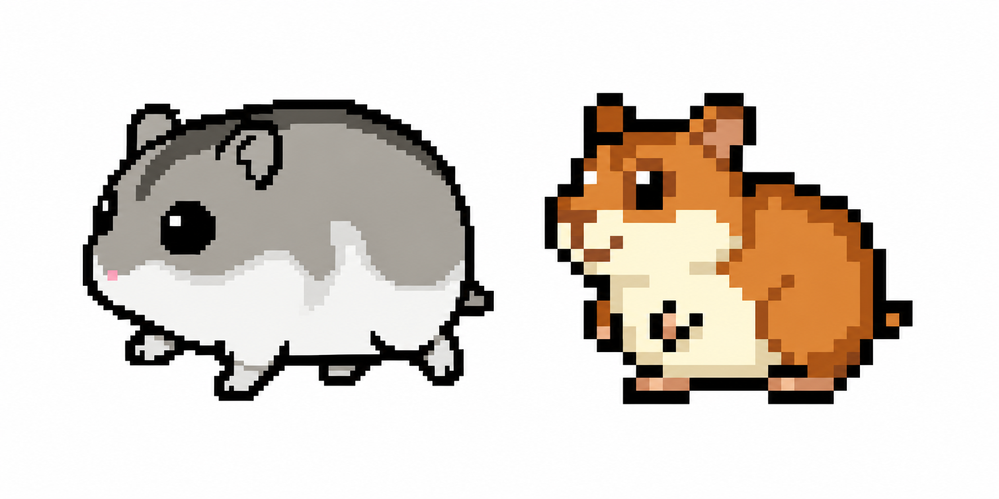

# HamsterDesktopRunners

デスクトップ上にハムスターを走らせることができる、Windows向け常駐型デスクトップアプリケーションです。

作業中のデスクトップに小さなハムスターを表示し、画面上を自由に動き回る様子を楽しめます。  
タスクトレイに常駐するため、必要なときに表示・終了できる軽量なデスクトップアクセサリーとして使用できます。

## 概要

HamsterDesktopRunners は、C# / WPF を使用して開発した Windows デスクトップアプリです。

ハムスターの表示・移動・追加・削除などを行い、デスクトップ上にちょっとした癒しを追加することを目的としています。

## 登場ハムスター

HamsterDesktopRunners では、
種類の異なるハムスターを選択してデスクトップ上に表示できます。

- ジャンガリアンハムスター
- ゴールデンハムスター

  

### 動作イメージ

## 開発アプローチ

本アプリケーションは、Antigravity を活用した Vibe Coding により開発しました。

自然言語で実現したい機能や動作イメージを整理し、  
AIと対話しながら実装・修正・改善を繰り返すことで、  
短期間で Windows 向けデスクトップアプリとして形にしました。

開発では、WPF による画面制御、タスクトレイ常駐、  
複数ディスプレイ対応、JSONによる設定保存などを実装しています。

AIによるコード生成を活用しつつ、  
生成されたコードの動作確認、機能調整、必要に応じた手動修正を行い、  
アプリケーションとして利用できる状態まで仕上げました。

## 主な機能

- デスクトップ上にハムスターを表示
- ハムスターの移動アニメーション
- ハムスターの追加
- 表示中のハムスターを全削除
- ハムスターの種類選択
  - ゴールデンハムスター
  - ジャンガリアンハムスター
- 表示対象ディスプレイの選択
  - すべての画面
  - 任意のディスプレイ
- タスクトレイ常駐
  - 表示
  - 終了
- 設定画面による動作設定
- JSONファイルによる設定保存

## 使用技術

- C#
- .NET 9
- WPF
- Windows Forms NotifyIcon
- JSON

## 動作環境

- Windows
- .NET 9 SDK

## バージョン履歴

| Version | 内容 |
|---|---|
| v1.00 | 初回リリース |
| v1.10 | ハムスターの種類を変更できる機能を追加 |
| v1.20 | ハムスターの行動パターンに「食事」を追加し、UIデザインを改善 |